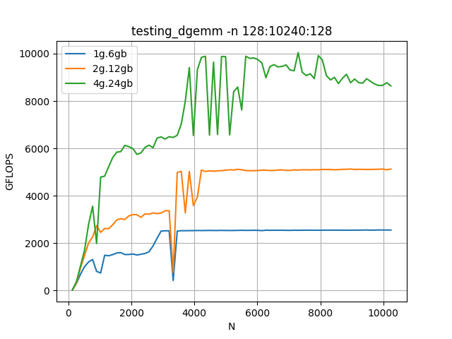
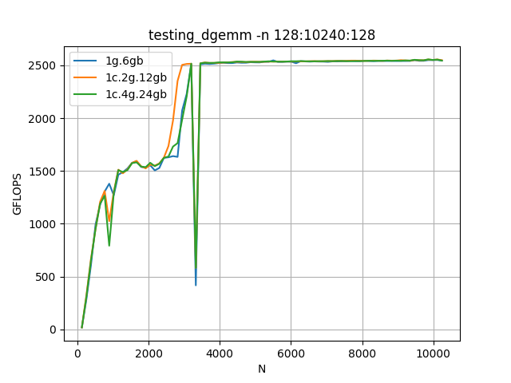
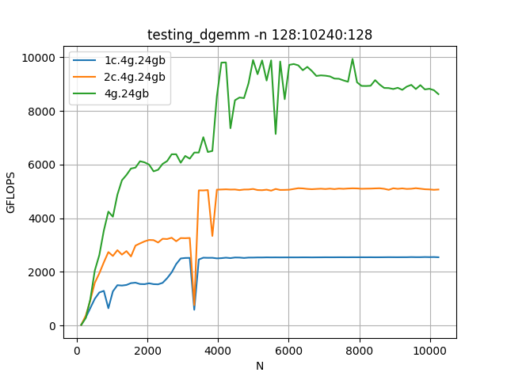

# GEMM

## 1. Configuración: 1g.6gb, 2g.12gb, 4g.24gb 

- **Resultado esperado:** el rendimiento de cada configuración debería ser aproximadamente el doble que la anterior, ya que se va duplicando el número de SMs.

- **Resultado obtenido:** el esperado.

## 2. Configuración: 1g.6gb, 1c.2g.12gb - 1c.4g.24gb

- **Resultado esperado:** las configuraciones deberían presentar rendimientos muy similares, ya que el número de SMs es el mismo en las tres.

- **Resultado obtenido:** el esperado.

## 2. Configuración: 1c.4g.24gb, 2c.4g.2gb, 4g.24gb 

- **Resultado esperado:** muy parecido a 1), ya que los números de SMs son los mismos que en 1), y la memoria no tiene tanta importancia en GEMM.

- **Resultado obtenido:** el esperado.
