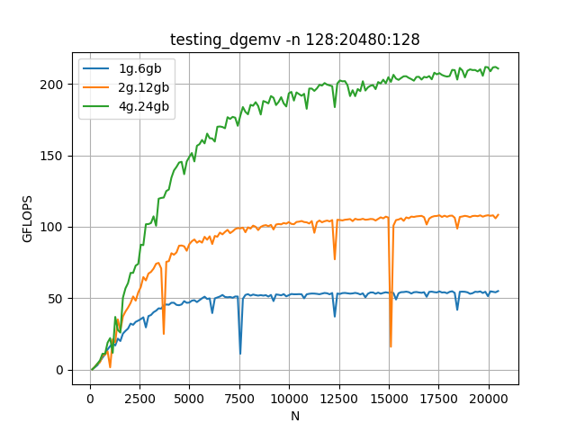
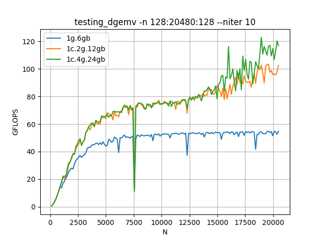
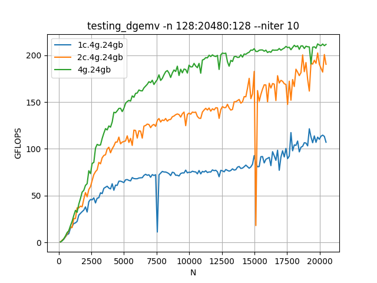

# GEMV

## 1. Configuración: 1g.6gb, 2g.12gb, 4g.24gb 

- **Resultado esperado:** el rendimiento de cada configuración debería ser aproximadamente el doble que la anterior, ya que se va duplicando el ancho de banda.
- **Resultado obtenido:** el esperado.

## 2. Configuración: 1g.6gb, 1c.2g.12gb - 1c.4g.24gb

- **Resultado esperado:** muy parecido a 1), ya que el número de SMs se mantiene constante, y el ancho de banda de la memoria va creciendo.
- **Resultado obtenido:** las dos primeras configuraciones se comportan de la forma que se esperaba. Sin embargo, la tercera tiene un rendimiento prácticamente igual a la segunda. Podría ser que 1/4 de los SMs no es capaz de usar más de la mitad del ancho de banda total de la GPU.

## 3. Configuración: 1c.4g.24gb, 2c.4g.2gb, 4g.24gb 

- **Resultado esperado:** las tres configuraciones deberían presentar un rendimiento similar, ya que el ancho de banda de la memoria se mantiene constante.
- **Resultado obtenido:** vemos que el número de SMs también limita bastante.
